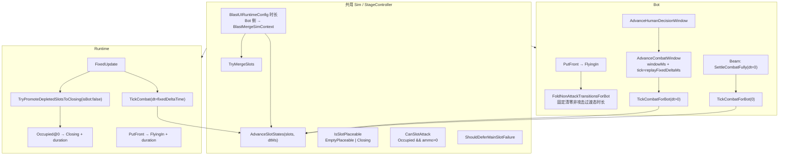
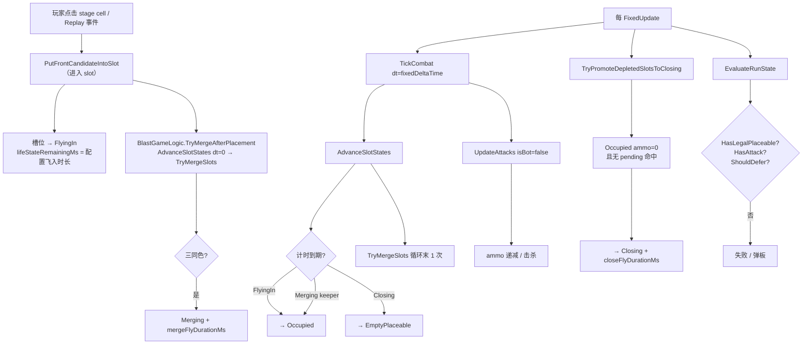
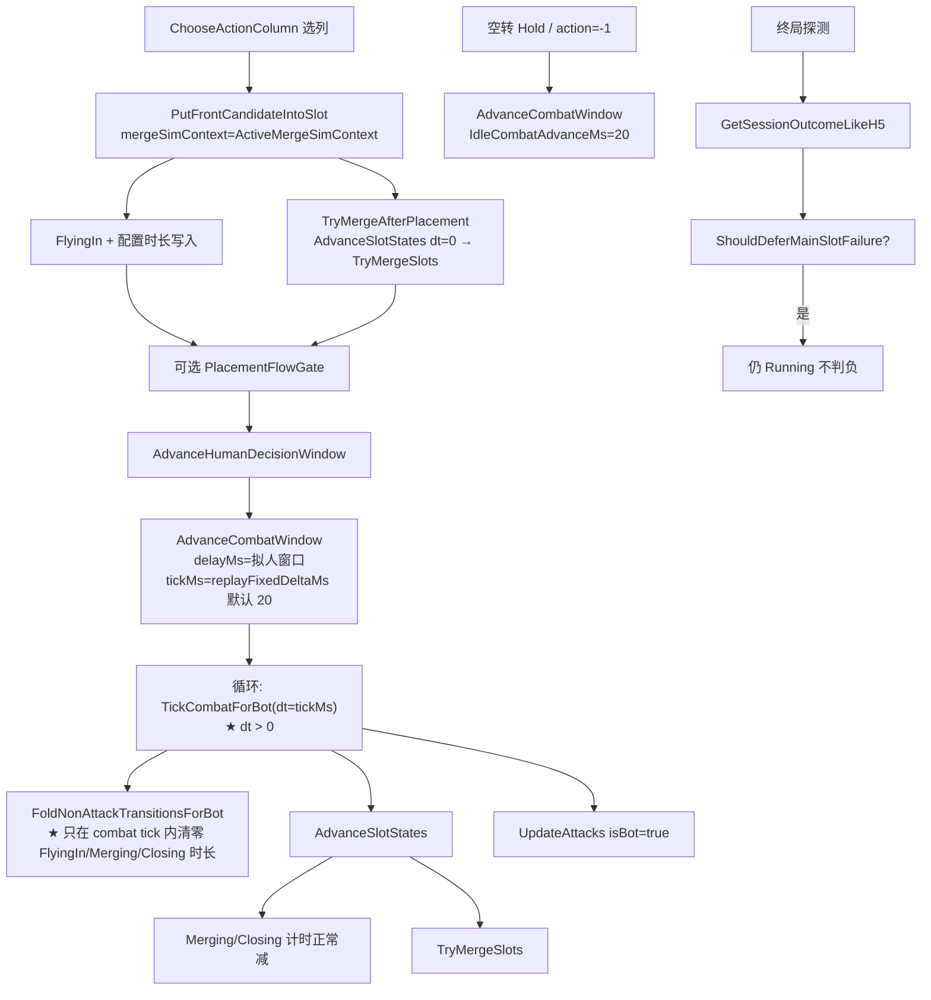
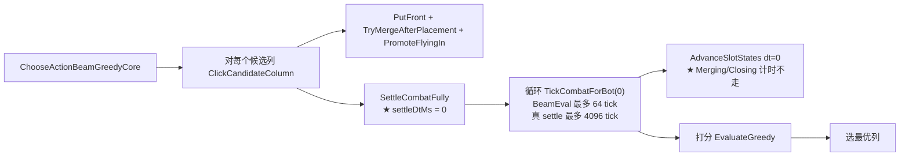
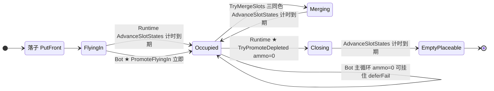

# Bot 与 Runtime 槽位状态：驱动与使用对照

> **用途**：说明 Bot 批跑与 Unity Runtime 在槽位 `lifeState` **谁推进、如何读** 上的异同，避免把 Beam 决策层参数误当成真局主循环行为。  
> **相关**：[`Bot_Architecture.md`](Bot_Architecture.md) · [`Gameplay_Rules_Logic.md`](../MainGame/Gameplay_Rules_Logic.md)

---

## 1. 一句话结论

| 维度 | 相同 | 不同 |
|------|------|------|
| **状态机规则** | `AdvanceSlotStates`、`TryMergeSlots`、`IsSlotPlaceable`、`CanSlotAttack`、`ShouldDeferMainSlotFailure` 共用 Sim/StageController | — |
| **时长配置** | FlyingIn / Merging / Closing 均来自 `BlastUIRuntimeConfig` | Bot worker 经 `BlastMergeSimContext` 缓存，不读 `BlastUIRuntimeConfigProvider` |
| **时间驱动** | 均经 `BlastGameLogic.TickCombat` → `AdvanceSlotStates` | Runtime：`FixedUpdate` + `fixedDeltaTime`；Bot 真局：`AdvanceCombatWindow` 分片 + `replayFixedDeltaMs` |
| **显式捷径** | — | Bot 统一走 `FoldNonAttackTransitionsForBot`；策略仅由 `RunOptions.nonAttackTransitionFoldPolicy` 枚举控制 |
| **Beam settle 步长** | — | Beam **`SettleCombatFully`** 使用 `dt=0` 评估步长（非 `RunSingleInternal` 主循环） |
| **merge 攻击门禁** | Runtime / Replay / Bot 共用 `CanSlotAttack` | `Merging` 期间不可攻击；仅 `Occupied` 且 `ammo>0` 可攻击 |

### 1.1 本文职责边界

- 本文只维护“Runtime/Bot 槽位状态驱动与使用口径”的事实对照。  
- 若与实现结果发生冲突，以 Runtime 行为为基线回修实现与文档，不反向改 Runtime 规则。
- 批跑快跑项只收外层 replay / 导出 / 日志 / 进度 UI 开销，不改变 `lifeState` 时序、`TickCombat` 顺序或 `TryPromoteDepletedSlotsToClosing` 口径。

---

## 1.2 Board 掉落锁与 timing context

- Runtime 与 Bot 共用 `BlastDropTimingContext`：主线程从 `BlastUIRuntimeConfig` 捕获 `baseDuration`、`accelerationMultiplier` 与回弹高度参数（`fullStrengthRows` / `oneRowScale` / `maxScale`；高度映射曲线仅主线程 UI 求值），再注入 `BlastSpawnContext`；worker 不读取 `BlastUIRuntimeConfigProvider`。
- `BlastEngine.SimulateDropAndRefill` 在完整 settle/refill/normalize 前后按 runtimeId 登记 `dropLandRemainMs` 与 `dropSequenceIndex`，普通新生成块在同列使用等距虚拟来源轨道的统一距离，Pool 新块使用 Pool 下边缘到目标格的一段距离，覆盖普通块、Gate、Block2x2、Key 和 Pool 新块。Wall 横移、Snake shorten、Curtain 转换不误加锁。
- `BlastGameLogic.TickCombatInternal` 只在 tick 开始扣落地锁；Bot 真局使用与 Runtime 相同的 `replayFixedDeltaMs` 推进，所以锁清零前不会攻击块，回弹时长不进入 Bot 计时。Beam 的 `dt=0` 仍表示不推进时间的候选评估。
- `BlastBoardDropLanding.IsAttackable` 同时用于底行候选、普通队列、机会判断和 stale-target 防守校验；Gate/Block2x2 组内任一成员未落地，整组不可攻击。

---

## 2. 代码锚点

| 符号 | 路径 | 职责 |
|------|------|------|
| `BlastGameController.FixedUpdate` | `Runtime/BlastGameController.Gameplay.cs` | Runtime 每帧 combat + promote depleted |
| `BlastGameLogic.TickCombat` | `Sim/BlastGameLogic.cs` | `AdvanceSlotStates` → `UpdateAttacks` 统一顺序 |
| `BlastGameLogic.TryPromoteDepletedSlotsToClosing` | `Sim/BlastGameLogic.cs` | `Occupied@ammo=0` → `Closing` |
| `BlastStageController.PutFrontCandidateIntoSlot` | `Runtime/BlastStageController.cs` | 点击 stage cell 后将 candidate 写入 slot（`FlyingIn`） |
| `BlastStageController.TryMergeSlots` | `Runtime/BlastStageController.cs` | merge 分组；接受 `Occupied` + `FlyingIn` |
| `BlastMergeSimContext` | `Core/BlastMergeSimContext.cs` | Bot merge 等级 + 飞入/merge/close 时长缓存 |
| `BlastBotService.RunSingleInternal` | `Editor/Bot/BlastBotService.cs` | Bot 单局主循环 |
| `AdvanceHumanDecisionWindow` / `AdvanceCombatWindow` | `Editor/Bot/BlastBotService.Simulation.cs` | 拟人窗口 + combat 分片 tick |
| `FoldNonAttackTransitionsForBot` / `RunBotCombatTick` | `Editor/Bot/BlastBotService.Simulation.cs` | Bot 非攻击过渡态时长映射与 combat 统一入口（先清零 `FlyingIn/Merging/Closing` 时长，再走 runtime 同款 tick/promote） |
| `SettleCombatFully` | `Editor/Bot/BlastBotService.SimulationTail.cs` | Beam 决策：`dt=0` 快速 settle |
| `GetSessionOutcomeLikeH5` | `Editor/Bot/BlastBotService.Simulation.cs` | Bot 终局/失败探测（含 `ShouldDefer`） |

---

## 3. 总览：谁驱动 `dt`，谁读状态

---

## 4. Runtime：状态变化驱动

**要点**

- **时间源**：Unity `FixedUpdate`，连续 `Time.fixedDeltaTime`。
- **`TickCombat` 顺序**：`AdvanceSlotStates` **先于** `UpdateAttacks`，避免 FlyingIn 到期前已 Occupied 的槽被先打掉导致 merge 凑不齐。
- **`FlyingIn`**：等配置时长自然到期；**无** headless promote。
- **打空弹**：每帧 `TryPromoteDepletedSlotsToClosing` → `Closing`。

---

## 5. Bot 真局主循环：状态变化驱动

入口：`BlastBotService.RunSingleInternal` → 选列点击 stage cell → `PutFrontCandidateIntoSlot`（进入 slot）→ `AdvanceHumanDecisionWindow` → `AdvanceCombatWindow`。

**要点**

- **配置时长与 Runtime 同源**；主循环 **不是全程 `dt=0`**，而是 HumanWindow 内按 `replayFixedDeltaMs`（默认 20ms）分片推进。
- **`AdvanceCombatWindow`** 每 tick 顺序为 `TickCombatForBot(dt>0)` → `TryPromoteDepletedSlotsToClosing` → `FoldNonAttackTransitionsForBot(activePolicy)`；`activePolicy` 只负责把指定过渡态的 `lifeStateRemainingMs` 清零，再交给公共状态机推进。
- **单点映射入口**：`FoldNonAttackTransitionsForBot`（策略枚举：`KeepRuntimeLike` / `SkipStageToSlotFlyingIn` / `SkipFlyingInAndClosing` / `SkipFlyingInClosingAndMerging`）。
- **差异入口**：主循环与 Beam 均在每个 combat tick 后调用 `TryPromoteDepletedSlotsToClosing`；是否立刻收口 `Closing` 由 fold 策略决定。
- **克隆视图**：Bot 评估使用的 `CloneSlots()` 现在会保留 `lifeState` / `lifeStateRemainingMs` / `ammoMax` / `mergeScoreBoostActive`，避免把 `Closing` 误克隆成默认 `Occupied`。
- **Beam 参数显式化**：`BlastBotRunOptions` 含 `beamSettleTickMs` / `beamSettleMaxTicks`；Beam `SettleCombatFully` 用前者（默认 dt=0 oracle）。
- **终局探针分离**：`ProbeFullSettleSnapshot` 走 `SettleCombatFullyForTerminalProbe`（正 `replayFixedDeltaMs` + `DefaultTerminalProbeSettleMaxTicks`），不复用 Beam 零时间 settle。
- **merge 等级**：worker 线程通过 `[ThreadStatic] ActiveMergeSimContext` + `RunOptions.CachedMergeSimContext` 传入 `TryMergeSlots`，避免误读 Editor 低 `CurrentGameLevel` 导致三同色不 merge。

---

## 6. Bot Beam 决策层（仅选列，非真局时序）

`BlastBotService.Decision.cs` → `ClickCandidateColumn` → `SettleCombatFully`。

**要点**

- 这是 **决策 oracle**：在 clone 上快速估算“落这一列后 combat 能走多远”，**不代表**真局一步的墙钟或完整逻辑时间。
- 每次 settle tick 前统一走 `FoldNonAttackTransitionsForBot`，采用与主循环一致的“时长清零”语义。
- **`dt=0` 时 `AdvanceSlotStates` 不减 `lifeStateRemainingMs`**；`Merging` 期间仍不可攻击，beam 在 merge 窗口会被阻塞，直到状态推进或时长映射收口。

---

## 7. 状态「使用」对照（读状态 / 判据）

| 判据 | 实现 | Runtime | Bot 真局 | Bot Beam |
|------|------|---------|----------|----------|
| **可落子 / 空槽** | `BlastStageController.IsSlotPlaceable` | `EmptyPlaceable` 或 `Closing` | 同左 | 同左 |
| **可攻击** | `BlastStageController.CanSlotAttack` | `Occupied` 且 `ammo>0` | 同左（FlyingIn 已 promote） | 同左 |
| **merge 分组** | `TryMergeSlots` | `Occupied` + `FlyingIn` | 同左 | 同左 |
| **暂缓判负** | `ShouldDeferFailureForTransientState`（含槽位 `ShouldDeferMainSlotFailure` + 棋盘 Closing） | 过渡态 + 待收口 + Board Closing | 同左 | Beam：仅正 dt settle 才因 Closing 续跑 |
| **merge 等级门** | `notMergeLv` / `BlastMergeSimContext` | `CurrentGameLevel` | `CachedMergeSimContext` | ThreadStatic 同上 |
| **打空收口** | `TryPromoteDepletedSlotsToClosing` | 每 `FixedUpdate` | 通过 Bot 单点 API 间接调用 | 通过 Bot 单点 API 间接调用 |

### 7.1 暂缓判负覆盖范围（Bot 与 Runtime 对齐）

- 槽位：`Closing` / `Merging` / `FlyingIn`（`ShouldDeferMainSlotFailure`）
- 槽位：`HasSlotsDepletedPendingClose`（连体/单体 `Occupied@0` 待收口）
- 棋盘：`BlastBoardClosing.HasPendingClosingOccupancy`（`closeRemainMs > 0`）
- 收口 API：`BlastGameLogic.ShouldDeferFailureForTransientState(state, slots)`
- Runtime：`HasEliminableBlockForSlots`；Bot：`GetSessionOutcomeLikeH5` / `TakeDecisionSnapshot` / `AdvanceCombatWindow` 续窗条件（不含玩家 linked soft-lock 特例）
- **与攻击机会正交**：Closing 抬住底行时 `HasAttackOpportunityRuntime` 仍可为 false；暂缓只阻止永久失败，不伪装可开火。

### 7.2 Replay 签名与 promote 顺序

- Bot 导出 replay 的 `postSig` 在 **`PromoteFlyingIn` 之前**采集（与 Runtime 落子后仍为 `FlyingIn` 的签名一致）。
- promote 仅用于 headless combat/settle，不参与 replay 诊断签名。
- M2 最小签名已补齐：placement `note` 同步写入 `pre/postStateSig`、`pre/postSlotsSig`、`pre/postCandidatesSig`（保留 `pre/postSig` 兼容旧链路）。
- M4 逻辑事件优先：placement `action_note` 追加 `event=placement_logic`，Runtime 继续按 `type + action_note` 执行，不依赖动画中间态。

---

## 8. 槽位生命周期（简化）

---

## 9. 常见误解

| 误解 | 事实 |
|------|------|
| Bot 全程 `dt=0` | 仅 **Beam `SettleCombatFully`**；真局 `AdvanceCombatWindow` 与 **终局探针** 使用 `dt>0` |
| `IsSlotPlaceable` 仅 Bot 特判 | **共用** API；`Closing` 可落子为设计行为 |
| Bot 私有 merge 时长 | 与 Runtime **同一套** UI 配置，经 `BlastMergeSimContext` 注入 |
| Bot 不调 promote depleted = 规则不同 | 已对齐：Bot 每个 combat tick 后也会调用 `TryPromoteDepletedSlotsToClosing` |
| Beam 分数 = 真局一步后的盘面 | Beam 是 **dt=0 oracle**；真局会走 HumanWindow 分片时间 |
| 无攻击机会 = 永久死局 | Closing 空窗时机会门可为 false，但 `ShouldDeferFailureForTransientState` 仍 Running |

---

## 10. 维护说明

- 修改 `TickCombat` / `AdvanceSlotStates` / `TryMergeSlots` / `ShouldDeferMainSlotFailure` 时，同步本页与 [`Gameplay_Rules_Logic.md`](../MainGame/Gameplay_Rules_Logic.md)。
- 修改 Bot 主循环时序时，同步 [`Bot_Architecture.md`](Bot_Architecture.md)。
- 修改 merge 等级或 `notMergeLv` 时，同步 [`Gameplay_Rules_Logic.md`](../MainGame/Gameplay_Rules_Logic.md)。

