# Gameplay Flow Logic（主流程）

本文对应 `Playbooks/gameplay-flow-logic.md`，聚焦**关卡加载、主循环推进、道具流程、胜负与续命**（`BlastGameController` 仿真编排）。切场景与壳层 UI 见 `Doc/MainGame/Scene_And_UI_Transition.md`；窗口框架见 `Doc/Tools/UIManager_Usage.md`。

## 1. 运行时总入口

- 总编排器：`Runtime/BlastGameController`（partial）。
- 关键分文件：
  - `Runtime/BlastGameController.cs`
  - `Runtime/BlastGameController.Loading.cs`
  - `Runtime/BlastGameController.Gameplay.cs`
  - `Runtime/BlastGameController.Stage.cs`
  - `Runtime/BlastGameController.Views.cs`
  - `Runtime/BlastGameController.State.cs`

## 2. 一局主流程

1. `LoadLevel(...)` 解析关卡并构建运行态数据。
2. `FillQueueFromLevel(...)` 生成本局队列。
3. `BlastLevelLoader.BuildCandidates(...)` 构建候选区。
4. `FixedUpdate()` 固定步长推进攻击与下落补块，`Update()` 只处理热键与视图刷新。
5. `EvaluateRunState()` 判定胜负并进入 Win/Lose 状态（结算 UI 打开见 `Scene_And_UI_Transition.md`）。

首次进入主游戏时，`UIGameMainView` 先等待 Board/Slots View 对象池分帧预热完成，再启动 `LoadLevel`；`OnGameMainUiReady` 只在关卡逻辑、首轮 View 绑定和布局稳定后派发一次。引导入口在该事件派发前读取加载前的 `GameLevelDatas` 记录快照，避免 `MarkLevelPlayingState(1)` 将首次进入误判。重载、下一关与跳关仍直接走同步 `LoadLevel`，保持回放动作顺序不变。

### 2.0 攻击表现时序（Data 先行）

- 命中结算仍由 `BlastGameLogic.TickCombat` + `RegisterHitComboBonus` 驱动，先更新分数/连击/进度等 Runtime 数据。
- 攻击飞行、Stage/Slot 动画与放置过渡细节（含 `1-2/0-1/2-3`、`idle_3/res3`、飞行对象口径）统一维护在 `Doc/MainGame/Stage_Animal_Animation_Playback.md`。Board→Slot 终缩 `boardToSlotFlyEndScaleFactor` 为相对 10x10 牌面初始大小（`localScale=1`）的绝对终值，不乘当前盘面起飞缩放。
- Objective 金币层级只影响表现：金币与罐子同挂 `BoardViewUp` 时，命中态罐子沉底、金币置顶；发币 Slot 小动物挂层与玩法流程不变，细节见 `GM_Board_Flow.md`。

### 2.0.1 棋盘蛇身渲染（当前实现）

> 动画名细节真源：`GM_Board_Flow.md` §5.6。

#### 入口与职责

| 类 | 职责 |
|----|------|
| `BlastBoardCellVisualDataBuilder` / `BlastBoardCellSnakeAnimResolver` | Head=`attackEndIdx`，Tail=内缩端；邻格→anim/skin；Closing 时 body（除头）`playClose` |
| `BlastSnakeShortenResolver` | Closing 几何 from/elim；计时跟块 `closeRemainMs`；`IsClosing` 只认本蛇组 Closing |
| `BlastBoardClosing` | 击杀 Closing 占位；Tick 清坑 / Key PendingUnlock |
| `BlastBoardCellView` | Head/Body 走 `BlastBoardSpinePool`；可见 2=Head+Body（`start_*`）；可见 1=仅 Head（击杀挂层 close）；≥3 Tail 占位不亮 SnakeTail；`playClose` 只播 close |
| `BlastBoardCellView` 异色 2x2 | `BoardColors.prefab` 按需从对象池加载，close 完成或 cell 回收时整体归还对象池 |
| `BlastBoardView` | killed Tail 不走 PlayCloseVisual；`playClose` 边沿刷 close/idle；清坑 `RecycleOrphanSnakeCellsAfterShorten` |

`BlastBoardView.ApplyRuntimeDelta`：shorten 边沿（`playClose` 变化）`SyncAliveSnakeGroupVisualsOnShortenEdge`；hit 走 Head `show`。切关 `ResetRuntimeState` + `BlastBoardSpinePool.ReleaseAll()`；道具 forceRuntime / dirty 全量重建走 `RebuildFromCurrentState`（禁止冒充 `BindInitialState`）。

运行期视图编排：Controller `RequestRuntimeViewRefresh` → Presenter `RefreshRuntimeViews`（Board → Slots delta → Stage delta → Effects）。Controller 不直调三区 View 的 Bind/Apply/Refresh。`FixedUpdate` 仅在 Board dirty、Slots 可视字段 hash、Stage version、强制特效或 bullet 活动态变化时发起刷新请求；Presenter 再按主槽/临时槽可视字段 hash 门控 Slots delta。固定帧数据未变化时不构建刷新请求，也不遍历 Cell 或重复触发临时槽布局同步。

### Slot 与续命专题

- Slot 区的渲染、动物生命周期、Temp 收缩及 ID 规则见 [Slot_Area_Logic.md](Slot_Area_Logic.md)。
- 失败续命的判定、确认与 Main→Temp 迁移见 [Fail_Revive_Logic.md](Fail_Revive_Logic.md)。


### 回退道具：按快照重建三区

回退不调用普通 `LoadLevel`，也不恢复上一次攻击进行中的中间效果。唯一入口：`ApplyRollbackRestore`。

```mermaid
flowchart LR
  UseRollback[ApplyRollbackRestore] --> RestoreData[RestoreRollbackSnapshot Clone]
  RestoreData --> Invalidate[InvalidateStagePowerUpRevealState]
  Invalidate --> ClearCombat[清 pendingKey / bullet边沿 / AttackSystem]
  ClearCombat --> ClearFx[ClearBullets]
  ClearFx --> Reload[ReloadViewsFromRollbackSnapshot]
  Reload --> Cancel[CancelAllTransientTasks]
  Cancel --> Recycle[RecycleForReload]
  Recycle --> Init[InitLevelViews BindInitial + RestoreAnimals]
  Init --> Resume[RefreshLevelProgress]
```



- 快照真源：`BlastGameRollbackRuntime.BuildSnapshot` / `CloneState|CloneSlots|CloneCandidates`；恢复时再次 Clone，禁止直接赋 snapshot 内引用。
- 三区重建：`ResetViewsForRebind` → `InitLevelViews`（Board `BindInitialState` / Stage `BindInitialCandidates` / Slots `BindInitialSlots` + `RestoreOccupiedAnimalsFromLogic`；锤子态随 Init 参数写入）。
- 清除范围：旧 close/fly、placement、Tween、连线、Spine、pending key unlock、攻击 cooldown/targeting、reveal 过渡。
- 不恢复：攻击中的 bullet、飞行动画、半截 close、旧 merge 演出。
- 临时任务：`BlastGameTransientTaskRegistry.CancelAll` 覆盖 detached close、fail-revive delay、Stage reveal delay；`_uiAnimPlanCts` 覆盖 placement / UI anim plan。
- `ClearBullets` 只清 `_bullets`；View/特效/连线由 `ResetViewsForRebind` 统一清，禁止双清。
- 重建完成后禁止再 `MarkAllDataDirty` / `PostPowerUpStateChanged` 脏刷：回退后只直调 `RefreshHudView` + `EvaluateRunState`。

#### 部位判定

- **Head** = `attackEndIdx`；**Tail** = 随 `blocksEliminated`（Closing 用 `shortenFromBlocksEliminated`）内缩
- 紧挨 Tail 且可见≥3 → **LastBody**；其余中间 → **Body**
- 可见 2：非 Head → **Body**（`start_*`）
- 可见 1：仅 **Head**（击杀播 Head `close`）
- 回退：`snakeValue==2` → Head，`3/-1` → Tail，其余 → Body

#### 邻格与动画名（摘要）

| 方向 | 判定 |
|------|------|
| 左 / 右 | `x <` / `x >` |
| 上 / 下 | `y <` / `y >`（y 更小=上） |

- 前=朝 Head，后=朝 Tail（`ResolveSnakeForwardStep`）
- 直线 Body：idle `body_hor/ver_idle`；close 按后一个 → `body_left/right_close`、`body_up/down_close`
- 中间拐角：仅横+竖 → `body_{后相对当前}_{当前相对前}_*`；同轴（同向或对向如 `right_left`）无资源 → 回落直线 idle/close
- LastBody：`body_start_*`；横+竖两段、同轴单段；close 与 idle 同前缀
- 可见 2 Body：`start_{dir}_idle/close`（`dir`=Head→Body：up/down/left/right；须 `bodySkin` + 开 SnakeBody）
- 触发：整组要么全 close、要么全 idle；shorten 边沿看 `playClose` **或** `idleAnim`/`visualKind` 变化（避免 3→2 漏切 `start_*`）；`IsClosing` 勿认链上他格 Closing

#### Spine / 缩短 / 回收

见 `Board_Cell_Animation_Playback.md` §4.8；配置 `BlastUIRuntimeConfig.snakeCloseDuration`。

#### 蛇纹层


### 2.0.2 棋盘布局与其它单格视觉

- `BlastBoardView` 的棋盘布局参数（`boardCellWidth` / `boardCellHeight` / `boardCellSpacingX` / `boardCellSpacingY`）统一由 `BlastUIRuntimeConfig` 配置。`gridRoot` 与 `gridContent`（mask）均采用中心锚点（pivot `0.5,0.5`），其尺寸固定不随关卡变化；`ApplyBoardLayout` 仅按“列宽需求”计算已绑定的 `boardLayoutRoot` 缩放（宽度适配），`gridContent` 作为 mask 区域保持固定尺寸，保证列适配时不缩小可视窗口。`boardLayoutRoot` 使用左下锚点与左下 pivot（`anchorMin/anchorMax/pivot = 0,0`），以保证缩放原点与布局起点一致为左下角。`BlastBoardView` 的 6 个序列化引用（`gridRoot/gridContent/boardLayoutRoot/cellPrefab/snakePatternRoot/snakePatternBaseMaterial`）均为必绑；`boardLayoutRoot` 未绑定或不在 `gridContent` 直系子节点下会直接抛错，不再运行时自动创建/兜底。高度不做强制适配，超出部分允许在 mask 外裁切。`visibleRows` 不再固定取关卡行数，而是按 `gridContent` 当前可视高度动态计算“最多能显示多少行”，并采用向上取整以包含“最后一行仅部分可见”的情况。横向与纵向落位均以 `gridContent` 左下角作为起点（不额外叠加左/下 padding）；同时通过行索引映射保证数据行序不反转（显示坐标与状态 y 方向一致）。渲染层级：仅对**有 cell 的座位**按「一行一行左上→右下」密排 sibling（右下最高）。无块 / companion 不挂 cell。离场回收挂 `BoardCellLeaving` 再整格入池。`BlastBoardCell` 子节点（BlockVisual / Block2_2 / Pool / Snake / Special / Label）不再在运行时改 `sizeDelta/anchoredPosition`；`BlastBoardView.Refresh()` 不再把 board state 当成“重刷静态 visual”的理由，Board 侧只驱动现有 cell 的移动、命中、消失与显隐，不做颜色重绑。`BlockVisual` 按 `colorType` 切换 `GameMainBlockAtlas` sprite；Gate 按 `GameMainBlockGateAtlas`；2x2 锚点走 `Block2_2_sample`（同色大图）或 `Block2_2_other`（异色四格小图）。局内 `Refresh()` 只更新格子内容与坐标。
- 下落动画规则：若目标格上方在前一帧有来源块，则从“上一格”下落；若来源块在当前可视区外，仍按 `SourcePos → TargetPos` 创建 cell 并播放 relocate，不能被主刷新误判为无来源的新补块；真正攻击后补入且无上方来源的新块，普通队列按同列等距虚拟来源轨道进入，Pool 出块则从对应 Pool 显示块的下边缘进入，横向对齐目标列并按 `boardCellPoolSpawnBottomOffsetPixels` 下移默认 20 像素，避免多个补块重叠在同一入口。普通格下落为两段式：第一段按 `DropRows/DropSequenceIndex` 将位移拆成连续逻辑段，同列使用本波最早段序号的共享段时钟，使用 `BlastDropTimingContext` 的几何时长；连续 relocate 从当前视觉位置续飞（不 snap 旧 fromPos），换行 `SetParent(..., true)`。列内掉落 token 全部结束后播第二段回弹（`boardCellDropReboundCurve` / `Duration` / `Decay`；底行=`BoardY` 最大，向上 `decay^i`；高度 `Lerp(oneRowScale, maxScale, heightCurve(t))`，细节见 `GM_Board_Flow.md`）。同列新掉落打断回弹并恢复静止位。Gate/Snake 不走普通列回弹。`IsRelocateMotionProtected`=`IsBoardDropActive`；`SnapTo` 仍受 `IsBoardMotionActive`（含回弹）保护。
- 掉落时序由 Sim 与 UI 共用纯 `BlastDropTimingContext`：单段为 `baseDuration * pow(accelerationMultiplier, sequenceIndex)`，连续段取总和；默认加速乘数 `0.9`，不设 MaxDuration 封顶。Sim 的 `dropLandRemainMs` 只覆盖第一段掉落，锁归零即可攻击，不等待回弹。
- `TickCombatInternal` 每个逻辑 tick 开始先扣旧落地锁；本 tick 攻击后产生的新 settle 在完整 `SimulateDropAndRefill` 结束时登记，不重复扣减。Runtime、Bot、probe、rollback clone 与 Replay 均携带同一 timing context 和 block timer，因此 Bot 只承受有限棋盘高度与固定加速带来的有界等待。
- `boardLayoutRoot` 的 `anchoredPosition/anchor/pivot/sizeDelta` 由 prefab 配置主导，运行时不再覆盖这些值；运行时代码仅做必绑/层级校验与宽度适配缩放更新。`visibleRows` 计算会纳入当前列适配缩放后的有效行高与步进，避免出现可见行数被限制在偏小值（如固定 11 行）的低估问题。
- `BlastBoardView` 会在关卡尺寸（`w/h`）变化或 `gridContent` 可视尺寸变化时重算布局缩放，避免首帧 UI 尺寸后到位时出现初始行高/可见行数不正确。
- `BlastBoardView` 的可视总行数采用 `state.Height + ceil(state.Queue.Count / state.Width)`：除棋盘当前行外，还会把候补队列按“每行 `Width` 个”映射为顶部候补行参与可视裁切与渲染，避免大队列关卡被 `state.Height`（如 14）封顶后看不到候补层。
- 队列映射顺序：候补行固定在棋盘上方；且“贴近棋盘的一行”显示队列头（最先补入），更上方显示后续候补。

### 2.1 程序实现版流程图

```mermaid
flowchart TD
  A[请求进入关卡] --> D[BlastGameController.LoadLevel]

  subgraph LoadPhase[开局加载]
    D --> D1[清结果窗 / 清特效 / 重置局内临时态]
    D1 --> D2[BlastGameLevelSession.LoadLevel]
    D2 --> D3[解析关卡路径]
    D3 --> D4[Parse LevelProfileConfig]
    D4 --> D5[BuildInitialState 构建棋盘状态]
    D5 --> D6[BuildCandidates 构建 Stage 候选]
    D6 --> D7[BuildInitialSlots 构建槽位]
    D7 --> D8[FillQueueFromLevel 构建本局队列]
    D8 --> D9[BuildDifficultyContext]
    D9 --> D10[BuildBaseQueue]
    D10 --> D11{是否存在 Pool 预留}
    D11 -->|是| D12[ExtractPoolQueuesFromQueue]
    D11 -->|否| D13[直接使用主队列]
    D12 --> D14[ApplyQueueDifficulty]
    D13 --> D14
    D14 --> D15[回写 State / Slots / Candidates / StarThresholds / DifficultyContext]
    D15 --> D16[ResetRunStateForLoadedLevel]
    D16 --> D16a[SyncAttackSystemSlotCount / ResetCooldowns / ResetAllCombatTargetingState]
    D16a --> D17[InitLvViews 绑定局内视图]
    D17 --> D18[记录回放 / BI上报]
  end

  D18 --> E[进入局内循环]

  subgraph MainLoop[局内主循环]
    E --> F[Update]
    F --> F1[仅刷新视图 RequestRuntimeViewRefresh / RefreshRuntimeViews]

    E --> G[FixedUpdate]
    G --> G1{State 和 Slots 是否有效}
    G1 -->|否| E
    G1 -->|是| G2{是否 Replay}
    G2 -->|是| G3[_replayPlayback.Step]
    G2 -->|否| G4[继续]
    G3 --> G4

    G4 --> G5{当前是否 Playing}
    G5 -->|否| G6[TryAdvanceCycle / 非游玩态维护]
    G5 -->|是| G7{是否被道具流程阻塞}
    G7 -->|是| E
    G7 -->|否| G8[CaptureBoardBeforeStep]
    G8 --> G9[BuildAttackSlotsBuffer]
    G9 --> G10[BlastGameLogic.TickCombat]

    subgraph Combat[战斗推进]
      G10 --> H1[ResolveKeyLockPairing]
      H1 --> H2[TickBoardClosing]
      H2 --> H3[再次 ResolveKeyLockPairing]
      H3 --> H4[BlastAttackSystem.UpdateAttacks]
      H4 --> H5[TickBoardClosing 清到期占位]
      H5 --> H5b[再次 ResolveKeyLockPairing Key下落/Lock推进]
      H5b --> H6[命中 / 击杀 / 收集物统计]
    end

    H6 --> G11[ProcessAttackHitFeedback]
    G11 --> G12[RegisterHitCombos / 加分 / 连击提示 / 进度刷新]
    G12 --> G13[MarkBoardDirty / MarkSlotsDirty / MarkStageDirty]
    G13 --> G14[EvaluateRunState]
  end

  subgraph Input[玩家点击 Stage]
    P1[点击候选列] --> P2[OnStageCellClicked]
    P2 --> P3[TryApplyStageCellClick]
    P3 --> P4{是否磁铁模式}
    P4 -->|是| P5[ResolveMagnetCandidate]
    P4 -->|否| P6[ResolveFrontCandidate]
    P5 --> P7[SaveRollbackSnapshot]
    P6 --> P7
    P7 --> P8[PutSpecificCandidateIntoSlot / PutFrontCandidateIntoSlot]
    P8 --> P8a{单体前排且视图动画开启?}
    P8a -->|是| P8b[逻辑立即更新；并行：前排 2to3 直接迁移同一个 AnimalView 到 Slot + 第二排 1to2 上移；link 组点击时整组并行飞向各自 slot，并对涉及列并行播放 1to2 上移，迁移中实时刷新组内连线；若触发三消，另外两格播 merge 并按独立 merge 移动时长同速汇聚到落点]
    P8a -->|否| P9[ResetTargetingStateForNewlyOccupiedSlot]
    P8b --> P10[FinalizeStageCandidatePlacement deferPlacementViewRefresh：不 MarkSlots/StageDirty；RefreshRuntimeViews 跳过 BindInitialSlots/BindInitialCandidates]
    P9 --> P10
    P10 --> P11[标记脏区 / 记录回放 / BI]
    P11 --> P11a{放置动画进行中?}
    P11a -->|是| P11b[Stage/Slot 共用放置流程状态机（FixedUpdate 驱动）：1to2 到点切 ClickReady；2to3 到点且目标主槽动物视图就绪后切 AttackReady 并 OnStagePlacementFlyLanded；放置过渡仅拦截受影响列，不全局禁点]
    P11a -->|否| G14
    P11b --> G14
  end

- Key/Lock 配对的 Stage 推进属于同 tick 数据结算；Key 飞行与 Lock close 仅为表现，不能阻塞后续失败/续命判定。
- StageCell 按钮监听改为单次绑定，刷新阶段仅替换当前格子的点击回调数据，不再每次 `SetVisual` 反复 `Remove/AddListener`。
- Stage 同列在 `StagePromoting` 阶段被拦截属于预期流程控制，不再输出错误日志。
- 调试阶段可通过 `[Blast][StageMoveStart][2to3/1to2]` 日志观察位移启动时序（含 frame/time、列与起止坐标）。
- runtime 结束弹窗（win/lose）只等表现层收尾（攻击飞行 / landing res3 / slot close 飞出），不使用逻辑 `_bullets` 门禁；仅在存在已绑定视图时生效，纯数据 bot 不受 UI 结算门禁影响。
- Slot 区与失败续命的实现细则分别见 [Slot_Area_Logic.md](Slot_Area_Logic.md) 与 [Fail_Revive_Logic.md](Fail_Revive_Logic.md)。
- `BlastGameViewPresenter` 负责 `board/slots/stage/effects` 的状态版本门控、HUD 可见态与 pending win 展示队列；Controller 保留玩法状态与流程调度。Stage 仅在状态版本推进时让各 cell 应用变更。

  subgraph Result[胜负收口]
    G14 --> Q0{Stage 与 Slot 均为空}
    Q0 -->|是| Q2[EnterWinState]
    Q0 -->|否| Q1{RemainingClearTargetBlocks <= 0}
    Q1 -->|是| Q2
    Q1 -->|否| Q3{无可攻击弹药 且 无可加载候选}
    %% 口径：弹 fail-revive 前要求主槽已占满，且「可攻击」只看主槽 Slots；临时槽位仅续命生效后（_tempSlotsActive）才参与后续死局判定。Stage 用 HasLegalPlaceableColumn（与 Bot legalPlaceableColumns 一致）。
    %% 玩家特例：主槽仅 1 空位且前排只剩连体候选（当前不可放）时，Runtime 不自动判输，等待玩家主动返回；Bot 仍按 Q3 死局口径结束。
    %% 暂缓：Stage→Slot 放置未到 AttackReady 时，EvaluateRunState 暂缓失败判定。
    %% 暂缓：ShouldDeferFailureForTransientState（主槽过渡态或棋盘 Closing 占位未清）时 hasUsableAmmo 视为仍可续，避免 Closing 空窗误弹失败。
    Q3 -->|否| E
    Q3 -->|是| Q4{主槽当前不可加载候选 且 可提供 fail revive 临时槽位}
    Q4 -->|是| Q5[弹 UIGameContinueView 续命板]
    Q5 -->|金币复活/IAP成功| Q6[TryConsumeFailReviveTempSlots spendCoins=false]
    Q6 --> G14
    Q5 -->|取消不播close| Q7[EnterLoseState]
    Q4 -->|否| Q7

    Q2 --> Q8[EnterWinState / 结算与存档]
    Q8 --> Q9{当前等级 >= 15?}
    Q9 -->|是| Q10[UIGameWinView: Collect/Double 带奖励与 Pass 演出返回大厅]
    Q9 -->|否| Q11[UIGameWinView: 页面展示奖励后进入下一关]
    Q10 --> D
    Q11 --> D

    Q7 --> Q12[EnterLoseState / 扣体力与失败存档并弹出失败页]
  end
```


## 4. 道具流程与入口

- 主逻辑：`Runtime/BlastGameController.PowerUps.cs`
- 关键协作：
  - `Runtime/BlastGameController.Stage.cs`
  - `Runtime/BlastGameController.State.cs`
  - `Runtime/BlastGameController.Views.cs`
  - `UI/BlastPowerUpConfirm.cs`
- 道具类型：磁铁、魔棒、锤子、回退；失败续命见 [Fail_Revive_Logic.md](Fail_Revive_Logic.md)。
- 战斗暂停：`PropUseUi.IsOpen`（道具使用弹板打开）即跳过主攻击。关窗顺序为先生效（Hold 等到效果完成）再 `UnregisterOpen` 恢复；`_wandShuffleAnimActive` / `_hammerAbsorbEffectActive` 收尾期间仍暂停。暂停期间连击窗（`shootIntervalMs`）同步冻结，不计入中断倒计时。回放无真实弹板时以 `IsHammerSelecting` / `IsMagnetSelecting` 对齐。
- 通用流程：状态校验 -> 需要时保存快照 -> 扣费/扣库存 -> 应用玩法改动 -> 刷新视图并记录回放动作。
- 回退恢复走 `ApplyRollbackRestore`：深拷贝恢复三区数据 → `CancelAll` + `RecycleForReload` → `InitLevelViews` 重建（含 Slot 动物补建与锤子态）；旧 close/fly 任务被取消后不再 Release，并刷新进度。
- 道具锁定提示继续走 `UIBubble`；首次解锁不再显示 Toast，也不再在进关时主动打开 UseView。
- 道具金币购买改走 `UIGamePropBuyView`（`RequestPowerUpPurchase`）：`CommonBuyBtn` 扣币后 `PanelTopbar` 金币 `PlayAdd`，滚完再 `Close` 并启动 `close1_0X` 的 `50/60s` 刷新计时 → `AddPowerUpAndSync` 刷道具栏；普通关闭播 `close2`。`BlastUIWindowView.Close(false)` 也会等顶栏数字滚动后再播退场。
- 魔棒（Prop2）弹板打开期间：`PropUseUi.IsOpen && !IsMagnetSelecting` 禁 Stage 点击；`EnterWandPreview` 顺带 `ClearBoardHammerClicks`，避免 BoardCell 残留可点。
- 锤子道具：选色期 + show 延迟 + 吸收飞口期间持续禁 `Stage` 点击（`IsHammerSelecting` / `_hammerAbsorbEffectActive`）；吸收完成统一 drop 后再放开。取消弹板 / 切场须清门控。
- 锤子确认：点击立刻播 show、停闪缩/扣费；`SchedulePropShowEffect(Hammer)` / `ResolvePropShowEffectDelaySeconds` 后 Closing + 逐块错峰 idle 飞（row 升序、同行左→右；`UiRewardFlyTween` PathCurve，按盘面列数+cell 列选 5 档曲线：左 1–2 / 中 3 / 右 4–5；总收集默认 1.2s，块间间隔衰减默认 0.95；终缩系数+曲线仍相对起始 localScale，不与 Board→Slot 绝对终缩同口径）；飞完回收 + `ClearHammerClosingAndDrop` 下落；Closing 前捕获 `health` 总和，按 ≤`stageCandidateNormalAmount` 切组随机插入候补队列同色 run 组缝（`seed=removed`），再 `SimulateDropAndRefill` 吸队列；不扣 Stage/Slot。Prop3 Hold 至吸收完再关窗。
- 道具确认统一口径：立刻 `NotifyEffectConfirmed` 播 show；效果按 `ResolvePropShowEffectDelaySeconds` 延迟执行——磁铁 Stage→Slot 飞、魔棒 Stage 换位、锤子 Closing/吸收飞、回退三区重建。四类弹板均 `HoldCloseUntilEffectReleased`，效果完成后再 `ReleaseHeldEffectClose` 关窗并恢复攻击。回放跳过延迟。
- 磁铁放置门控：`PutSpecific` 成功后立刻 `BeginStageSlotPlacementFlow` + `SetPendingPlacementAttackSlots`（新 FlyingIn 槽），并重写 `FlyingIn` 剩余时长 = `propShowDelay + stageAnimal2To3FlySettings2.FixedDuration`；`ConfirmMagnetUseEffect` 仍立刻清选态/扣费。PropShow 延迟回调只负责 `BeginPlacementAnim`（若需）+ 道具 2to3 飞（`UseProp2To3FlySettings`）/ merge；磁铁 Settings2 的 2to3 额外使用「飞行时间→缩放倍率」曲线（中途可放大、终点回 1）与平均归一化 Spine 速度曲线，飞行总时长仍为 `FixedDuration`，到达或取消时恢复起飞缩放与 Track 0 速度；落地 `AttackReady` 后清掩码。磁铁 2to3 起飞挂弹板 `MagnetFlyParent`（SafeArea 置顶 / 可选 `MiddleRect`，盖过挖洞遮罩；`HoldCloseUntilEffectReleased` 至落地）；落地 `Adopt` 回槽后 `ReleaseHeldEffectClose`。
- 磁铁 appear/关闭：与魔棒同口径，`RunStagePowerUpRevealTransition` → `SetMagnetMode(duration,ease)` 对齐 BlastAreaRoot Raise/Restore，第 4/5 行禁止闪切；列推进时新补末行从画面外移入（`OtherRowsAdvance` 时长）。
- 锤子进入选色 / 盘面确认：仅要求 `Playing`（`CanUsePowerUpNow`）；不再等待 Slot 攻击子弹或飞效/落地结束。
- 回退道具解锁引导（`gameLevel == unLockUseRollbackPowerUpLevel` 且 `ITEM_REWIND` 未完成）会在 `FixedUpdate` 按 `tipUseRollbackClickPos` 跨帧自动触发 Stage 前排点击；该配置按“列号从 1 开始”解释（如默认 `2,2` 表示第 2 列前排点击两次），把候选放入槽位用于演示回退使用场景；自动点击只在实机运行态生效（非回放），完成后不再自动打开 UseView。
- 四类道具引导以 GuideScenario Segment 为唯一状态：磁铁 `ITEM_BELL`、魔棒 `ITEM_WHISTLE`、锤子 `ITEM_CLEAR`、回退 `ITEM_REWIND`。仅当当前等级命中对应解锁等级且对应 Segment 的第 2 步正在播放时，道具按钮才直接打开免费 UseView；其他点击仍走库存、购买与正常扣费流程。引导关卡变体和特殊表演按对应 Segment 第 2 步是否完成判断，不再读写 `LvGuideState`。
- 连体候选（`linkGroupId >= 0`）入槽仍沿用 `BlastStageController` 的“连续空段优先，必要时左压缩后再判定”的逻辑；当触发左压缩时，播放连体放置动画前会先强制对齐 slot cell 的 parent/seat 位置，保证 UI 位置与逻辑槽位一致。
- Stage/Slot 放置动画、点击门控与列内过渡（`1-2/0-1/2-3`）已统一迁移到 `Doc/MainGame/Stage_Animal_Animation_Playback.md`，此处不再重复维护。`SlotRoot` / `SlotRootTemp` 的桌面根节点动画细节也收口到 `BlastSlotDeskRootView`，主流程只保留数量与状态口径。

详细道具机制请参考：`Doc/MainGame/POWERUP-SYSTEM-Unity.md`。

## 5. 中途退出（玩法口径）

- 局内设置 `BlastMainSettingView.ExitBtn`：`Profile.Level < GameConst.MainSceneUnlockLevel`（不能进主界面）时隐藏；已解锁时点击先打开 `UIGameExitView` 确认窗；取消（`ClsoeUI`）仅关确认窗；确认（`ConfirmBtn`）关闭设置+确认窗后调用 `AbandonLevel()`。
- 关窗默认播退场：`BlastUIWindowView.Close()` 等价 `Close(false)`，先播 close（Animator/Timeline 或默认 tween）再销毁；只有需要跳过退场时才显式 `Close(true)`。`BlastMainSettingView.CloseBtn` 与 `UIGameExitView.ClsoeUI` 走默认路径播 `Ani_*_close`；`ConfirmBtn` 用 `Close(true)`，因为紧接场景切换。
- `UIGameExitView` 展示：顶栏按 `GamePanelConfig` 加载（当前配 `LifeNumObj`，由 `PanelTopbarManager` 刷新体力）；弹板内按 `CurrentLevelDifficulty` 切 Hard/SuperHard 角标与 `BgNormal`/`BgHard`；按 `IsEndlessHealthActive` 切 `NormalHealth`/`EndlessHealth`，无尽剩余用 `GetEndlessHealthRemainSeconds`，文案 `Enjoy unlimited lives for the next <color=#EB433A>{m}m{s}s</color>!`。无尽时 `EndlessHealthOverTimeText` 由 `TimerManager` 按 UI 刷新间隔循环刷新，并监听 `EndlessHealthChanged`；关窗时停表。
- `BlastGameController.AbandonLevel()`：主动退出时只扣体力、标记 `Ended`、记录回放/BI，并写入入口场景切换意图；场景切换由后续 `FixedUpdate` 统一消费。
- `EnterLoseState()` 只负责失败结算并弹出 `UIGameLoseView`；失败页展示 `CurrentGameLevel`、Hard/SuperHard 角标，以及按 `IsEndlessHealthActive` 切换 NPC；顶栏金币由 `PanelTopbar` 按配置加载；`CloseBtn` 仅主场景解锁时显示，点击走 `ReturnToLobbyFlowManager.StartReturnFlow(Collect, 0, 0)`；重试先校验体力，不足打开 `UIHealthView`，够则重载当前关。
- 主动退出单独写入入口场景切换意图，不承担 UI 清理、资源释放或场景加载。

## 5.1 胜利窗收口（壳层 UI 协作）

失败续命的判定门禁见 [Fail_Revive_Logic.md](Fail_Revive_Logic.md)。

胜利结算 UI、ADS 单双倍按钮、`ADManager.TryShowAdOrUseCoupon` 双倍领奖、本页/大厅飞金币详见 [`Win_Settlement_UI.md`](Win_Settlement_UI.md)。

- 结束弹窗统一再延迟 1s 打开：`UIGameWinView` / `UIGameLoseView` 在 `HasPendingEndResultVisuals` 收尾后再等 1s（`BlastGameViewPresenter.OpenPendingEndResultViewAfterDelayAsync`）；`UIGameContinueView` 在续命判定通过后再等 1s（`OfferFailRevivePromptAfterDelayAsync`）。延迟任务走 `BlastGameTransientTaskRegistry`，重载/切场 `CancelAll`。
- `EnterWinState`：通关奖经 `CoinEconomyUtil.ScaleReward(base)` → `QueuePendingWinView` → `AddCoins(total, false)`；细则见 [`Coin_Economy_Logic.md`](Coin_Economy_Logic.md)。
- 道具购买 / 失败续命 / 补体：调用方读配置 base 后 `CoinEconomyUtil.ScaleCost(base)`。
- 切场景入口统一关 UI / 解绑视图 / 清池；返回大厅串行步骤见 `StepDelaySequencer_Usage.md`。

## 6. 相关模块文档

- 回放链路：`Doc/MainGame/Blast_Replay.md`
- 动态难度：`Doc/MainGame/Blast_DynamicDifficulty.md`
- 玩法规则：`Doc/MainGame/Gameplay_Rules_Logic.md`
- 计分连击：`Doc/MainGame/Game_Score_Logic.md`
- 关卡初始化：`Doc/MainGame/Level_Entry_Init_Logic.md`
- 场景与壳层 UI：`Doc/MainGame/Scene_And_UI_Transition.md`
- 胜利结算 UI：`Doc/MainGame/Win_Settlement_UI.md`
- 局内视图刷新（Board/Stage 脏标记等）：`Doc/MainGame/GM_Board_Stage_Flow.md`
- UI 框架：`Doc/Tools/UIManager_Usage.md`
- 槽位区域：`Doc/MainGame/Slot_Area_Logic.md`
- 失败续命：`Doc/MainGame/Fail_Revive_Logic.md`

## 7. 类功能定位

| 类/文件 | 功能 | 路径 |
|---|---|---|
| `BlastGameController`（partial） | 主流程总编排、生命周期、状态流转 | `Assets/GameModule/GameMain/Script/Runtime/BlastGameController.cs` |
| `BlastGameRuntimeData` | 主流程 Data 层最小运行态容器；当前承载逻辑帧与累计毫秒 | `Assets/GameModule/GameMain/Script/Runtime/BlastGameRuntimeData.cs` |
| `BlastGameViewPresenter` | View/Presenter 层，集中刷新 Board/Stage/Slots/Effects/HUD/Progress | `Assets/GameModule/GameMain/Script/Runtime/BlastGameViewPresenter.cs` |
| `BlastGameLevelSession` | 关卡会话 Runtime/Application 层；当前承接 asset id、星级阈值、难度上下文构建辅助与 queue/pool 写回 State | `Assets/GameModule/GameMain/Script/Runtime/BlastGameLevelSession.cs` |
| `BlastGameRollbackRuntime` | 回退快照 helper 真源；集中 snapshot 构建与深拷贝（state/slots/candidates） | `Assets/GameModule/GameMain/Script/Runtime/BlastGameRollbackRuntime.cs` |
| `BlastGameController.Loading` | 关卡加载、队列填充、开局初始化 | `Assets/GameModule/GameMain/Script/Runtime/BlastGameController.Loading.cs` |
| `BlastGameController.Gameplay` | Update 推进、命中反馈、胜负判定 | `Assets/GameModule/GameMain/Script/Runtime/BlastGameController.Gameplay.cs` |
| `BlastGameController.PowerUps` | 道具流程调度与执行桥接 | `Assets/GameModule/GameMain/Script/Runtime/BlastGameController.PowerUps.cs` |
| `UIGameContinueView` | 失败续命正式弹板（金币 / FailOffer） | `Assets/GameModule/GameMain/Script/UI/UIGameContinueView.cs` |
| `UIGameExitView` | 局内主动退出确认窗 | `Assets/GameModule/GameMain/Script/UI/UIGameExitView.cs` |
| `FailOfferModel` | Play On Offer 门控/升降/发奖（自管单例） | `Assets/GameModule/FailOffer/Scripts/FailOfferModel.cs` |

维护规则：主流程类职责有变更时，先更新本表，再同步 `Doc/MainGame/module-index/game-main-agent-index.md`，必要时回写 `Doc/MainGame/gamemain-class-function-index.md` 总纲。
触感 Catalog 位于 `Assets/GameModule/Common/ConfigSo/GameHapticCatalog.asset`，运行时由 `GameHapticCatalogProvider` 按 `GameHapticCatalog.AssetPath` 加载；修改资源目录时需同步更新路径常量。
- 引导步骤使用 `Adaptation = 1` 且 `Character = UserNameEditView` 时，实例化的 `GuideUserNameEditView` 会在输入结束后先经 `ProfileUsernameValidator` 校验（3～12 位）；合法时写入用户名并触发远端同步标记，再通过 `GuideScenarioManager.NoticeNextGuide()` 进入下一步。普通改名入口也复用同一校验，非法名称只显示英文 `CommonPopToast`，不会写入或同步。
